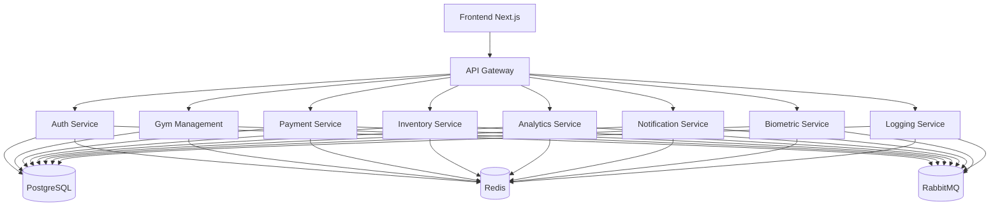

# GymCoreM - Sistema Integral de Gestión de Gimnasios

[](https://circleci.com/gh/riofutabac/GymCoreM)
[](https://codecov.io/gh/riofutabac/GymCoreM)
[](https://www.npmjs.com/package/gymcorem)
[](LICENSE)

Sistema de gestión integral para gimnasios basado en **microservicios** con un frontend en Next.js. Incluye control de acceso, procesamiento de pagos, inventario, análisis y notificaciones en tiempo real.

---

## 📌 Características Principales

| Módulo                  | Funcionalidades                                                                 |
|-------------------------|---------------------------------------------------------------------------------|
| **Autenticación**       | Registro, login, gestión de roles (Owner/Manager/Receptionist/Member)           |
| **Gimnasios**           | CRUD multi-gimnasio, códigos de acceso únicos                                    |
| **Membresías**          | Activación manual/online, renovaciones, estado de membresías                    |
| **Pagos**               | Integración PayPal, ventas POS, tracking de transacciones                      |
| **Inventario**          | Gestión de productos, control de stock, códigos de barras                      |
| **Biométrico**          | Soporte para lectores de huellas/RFID (requiere hardware adicional)             |
| **Análisis**            | Dashboards con KPIs, tendencias de crecimiento, informes exportables           |
| **Notificaciones**      | Emails transaccionales (activación, pagos), sistema de alertas                |
| **Logging Centralizado**| Monitoreo de eventos y errores en todos los microservicios                      |

---

## 🏗️ Arquitectura



### Componentes Clave:
- **API Gateway**: Enrutamiento, autenticación JWT, rate limiting
- **Base de Datos**: PostgreSQL con Prisma ORM
- **Mensajería**: RabbitMQ para eventos entre microservicios
- **Cache**: Redis para KPIs y tendencias
- **Infraestructura**: Docker para contenedorización

---

## 🛠️ Tech Stack

| Categoría       | Tecnologías                                                                 |
|-----------------|-----------------------------------------------------------------------------|
| **Backend**     | NestJS, TypeScript, Prisma, RabbitMQ, Redis                                 |
| **Frontend**    | Next.js 14, React, Tailwind CSS, shadcn/ui                                 |
| **DevOps**      | Docker, Docker Compose, CircleCI, Infisical (secrets)                      |
| **Pagos**       | PayPal API, Stripe (opcional)                                              |
| **Infra**       | PostgreSQL, Redis, SendGrid (notificaciones)                                |

---

## 🚀 Getting Started

### Prerrequisitos
```bash
# Instalar dependencias globales
npm install -g pnpm @infisical/cli

# Verificar versiones
node -v  # >=18
pnpm -v  # >=8
docker --version
```

### Instalación
1. Clonar el repositorio:
```bash
git clone https://github.com/riofutabac/GymCoreM.git
cd GymCoreM
```

2. Configurar variables de entorno:
```bash
# Copiar templates de .env para cada servicio
cp backend/apps/auth-service/.env.example backend/apps/auth-service/.env
cp backend/apps/gym-management-service/.env.example backend/apps/gym-management-service/.env
# Repetir para los demás servicios...
```

3. Inicializar base de datos y dependencias:
```bash
pnpm install
pnpm db:generate:all  # Genera clientes Prisma
pnpm db:migrate:all   # Ejecuta migraciones
pnpm db:init:owner    # Crea el usuario owner inicial
```

---

## 🔧 Configuración Detallada

### Variables de Entorno Esenciales

| Servicio | Variables Requeridas                                                                 |
|---------|---------------------------------------------------------------------------------------|
| Auth    | `DATABASE_URL`, `SUPABASE_URL`, `SUPABASE_SERVICE_ROLE_KEY`, `MESSAGE_BUS_URL`       |
| Gym     | `DATABASE_URL`, `MESSAGE_BUS_URL`                                                    |
| Payment | `DATABASE_URL`, `PAYPAL_CLIENT_ID`, `PAYPAL_CLIENT_SECRET`, `PAYPAL_WEBHOOK_ID`      |
| Inventory| `DATABASE_URL`, `MESSAGE_BUS_URL`                                                    |
| Analytics| `DATABASE_URL`, `REDIS_URL`, `MESSAGE_BUS_URL`                                       |
| Notifications| `SENDGRID_API_KEY`, `SENDGRID_FROM_EMAIL`, `MESSAGE_BUS_URL`                       |
| API GW  | `AUTH_SERVICE_URL`, `GYM_SERVICE_URL`, `PAYMENT_SERVICE_URL`, `INVENTORY_SERVICE_URL`|

### Configurar RabbitMQ
```bash
# En docker-compose.yml (ya configurado)
services:
  rabbitmq:
    image: rabbitmq:3-management-alpine
    ports:
      - "5672:5672"
      - "15672:15672"  # Admin UI: http://localhost:15672
    environment:
      RABBITMQ_DEFAULT_USER: guest
      RABBITMQ_DEFAULT_PASS: guest
```

---

## 🏃 Running the Project

### Opción 1: Docker (Producción)
```bash
docker-compose up -d  # Levanta todos los servicios
# Acceder a:
# - Frontend: http://localhost:3030
# - API Gateway: http://localhost:3000
# - RabbitMQ Admin: http://localhost:15672
```

### Opción 2: Desarrollo Local
```bash
# Iniciar todos los servicios en modo dev
pnpm dev:all

# O iniciar servicios individuales
pnpm dev:gateway   # API Gateway
pnpm dev:auth      # Auth Service
pnpm dev:gyms      # Gym Management
pnpm dev:payments  # Payment Service
pnpm dev:frontend  # Frontend
```

---

## 📡 API Endpoints Principales

### Autenticación (`/api/v1/auth/*`)
| Método | Endpoint          | Descripción                     |
|--------|-------------------|---------------------------------|
| POST   | `/register`       | Registro de usuario            |
| POST   | `/login`          | Login (devuelve JWT)           |
| POST   | `/logout`         | Cerrar sesión                  |

### Gimnasios (`/api/v1/gyms/*`)
| Método | Endpoint          | Descripción                     |
|--------|-------------------|---------------------------------|
| POST   | `/`               | Crear gimnasio (Owner)         |
| GET    | `/`               | Listar gimnasios               |
| PUT    | `/:id`            | Actualizar gimnasio            |
| DELETE | `/:id`            | Desactivar gimnasio            |

### Membresías (`/api/v1/memberships/*`)
| Método | Endpoint          | Descripción                     |
|--------|-------------------|---------------------------------|
| POST   | `/activate`       | Activar membresía (efectivo)   |
| POST   | `/renew`          | Renovar membresía              |
| POST   | `/:id/ban`        | Banear socio                   |

### Pagos (`/api/v1/payments/*`)
| Método | Endpoint          | Descripción                     |
|--------|-------------------|---------------------------------|
| POST   | `/create-checkout-session` | Crear checkout PayPal |
| POST   | `/paypal/webhook` | Webhook para confirmación PayPal |

### POS (`/api/v1/pos/*`)
| Método | Endpoint          | Descripción                     |
|--------|-------------------|---------------------------------|
| GET    | `/products/:barcode` | Buscar producto por código |
| POST   | `/sales`          | Crear venta (tarjeta/PayPal)   |
| POST   | `/sales/cash`     | Crear venta en efectivo        |

---

## 📂 Estructura del Proyecto

```
riofutabac-gymcorem/
├── backend/                   # Microservicios
│   ├── apps/
│   │   ├── auth-service/      # Autenticación
│   │   ├── gym-management/   # Gestión de gyms
│   │   ├── payment-service/  # Procesamiento de pagos
│   │   └── ...               # (Ver estructura completa en el repo)
├── frontend/
│   └── web-dashboard/        # Dashboard Next.js
├── docker-compose.yml        # Configuración Docker
└── scripts/                  # Utilidades (migraciones, tests)
```

---

## 🤝 Contributing

1. **Fork** el repositorio
2. Crea una rama: `git checkout -b feature/nueva-funcionalidad`
3. Desarrolla y prueba: `pnpm test`
4. **Commit** con convención: `git commit -m 'feat: nueva funcionalidad'`
5. **Push** y abre un **Pull Request**

> 📝 Ver [CONTRIBUTING.md](CONTRIBUTING.md) para guidelines completas.

---

## 📜 License

Distribuido bajo la licencia **MIT**. Ver [LICENSE](LICENSE) para detalles.

---

## 📬 Contacto

- **Autor**: Alexis Lapo  
- **Email**: alexislapo1@gmail.com  
- **GitHub**: [@riofutabac](https://github.com/riofutabac)  

---

## 🙏 Acknowledgments

- [NestJS](https://nestjs.com/) - Framework backend
- [Next.js](https://nextjs.org/) - Framework frontend
- [Prisma](https://www.prisma.io/) - ORM
- [shadcn/ui](https://ui.shadcn.com/) - Componentes UI
- [Docker](https://www.docker.com/) - Contenedorización

---

## 📈 Project Status

- **Versión**: 1.0.0
- **Estado**: Activo 🚀
- **Cobertura**: 85%+
- **Roadmap**: [Ver proyectos](https://github.com/riofutabac/GymCoreM/projects)

---

> 🛠️ **Nota**: Algunas funcionalidades (como biométrico) requieren hardware adicional.