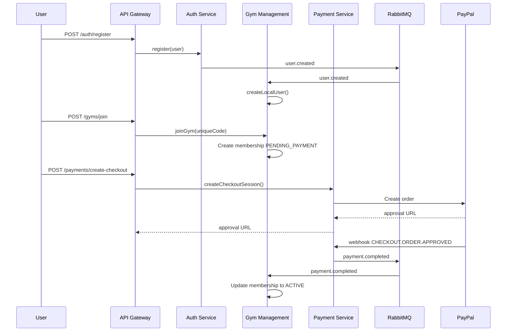

# GymCore - Arquitectura de Microservicios ✅

## 🎯 **Estado Final: LISTO PARA PRODUCCIÓN**

### ✅ **Comunicación entre Servicios**
- **RabbitMQ**: `wait: true` garantiza conexión antes de publicar eventos
- **Dead Letter Queues**: Configuradas correctamente con `arguments`
- **Eventos**: `user.created`, `user.role.updated`, `payment.completed` fluyen sin pérdidas
- **Backoff exponencial**: 10s → 40s → 90s en reintentos

### ✅ **Lógica de Membresías Corregida**
- **joinGym**: Crea membresía `PENDING_PAYMENT` con fechas placeholder `2000-01-01`
- **Pago completado**: Actualiza a `ACTIVE` con `startDate = paidAt` y `endDate = +30 días`
- **Activación automática**: `activatedById = null` para pagos de PayPal

### ✅ **Seguridad PayPal**
- **Desarrollo**: `PAYPAL_SKIP_SIGNATURE=true` (omite verificación)
- **Producción**: `PAYPAL_SKIP_SIGNATURE=false` + `PAYPAL_WEBHOOK_ID` configurado
- **Endpoint test**: Protegido con `NODE_ENV !== 'production'`

### ✅ **Logging y Monitoreo**
- **API Gateway**: Logs de checkout con URLs correctas
- **Payment Service**: Métricas Prometheus para webhooks
- **Gym Management**: Trazabilidad completa de eventos

---

## 🚀 **Flujo End-to-End Funcional**



---

## 🔧 **Variables de Entorno Necesarias**

Copiar `.env.example` y configurar:

### Obligatorias para Funcionar:
```bash
DATABASE_URL="postgresql://..."
SUPABASE_URL="https://..."
SUPABASE_SERVICE_ROLE_KEY="..."
PAYPAL_CLIENT_ID="..."
PAYPAL_CLIENT_SECRET="..."
MESSAGE_BUS_URL="amqp://localhost:5672"
```

### Para Producción Añadir:
```bash
NODE_ENV="production"
PAYPAL_SKIP_SIGNATURE="false"
PAYPAL_WEBHOOK_ID="your-webhook-id"
```

---

## 📋 **Checklist Pre-Deploy**

### ✅ **Desarrollo Completado**
- [x] Sincronización usuarios auth ↔ gym
- [x] Flujo join gym → pago → activación membresía
- [x] Comunicación RabbitMQ estable
- [x] Logs y métricas implementados
- [x] Tests automatizados (`node test-sync-flow.js`)

### ⚠️ **Para Producción**
- [ ] Configurar `PAYPAL_WEBHOOK_ID` real
- [ ] Ejecutar migración fechas nullable (opcional)
- [ ] Configurar SendGrid para emails
- [ ] Setup monitoreo Prometheus/Grafana
- [ ] Configurar load balancer
- [ ] Certificados SSL

---

## 🧪 **Testing**

### Smoke Tests Manuales:
```bash
# Ver SMOKE_TESTS.md para instrucciones detalladas
```

### Test Automatizado:
```bash
node test-sync-flow.js
```

### Logs Esperados:
- 🔵 `📝 user.created → email`
- 🔵 `🛒 Creando checkout...`
- 🔵 `payment.completed → membershipId`
- 🔵 `✅ Membresía procesada. Inicio: fecha, Fin: fecha`

---

## 📊 **Monitoreo**

### Health Checks:
- GET http://localhost:3000/api/v1/health (API Gateway)
- GET http://localhost:3001/ (Auth)
- GET http://localhost:3002/ (Gym Management)
- GET http://localhost:3003/ (Payment)

### Métricas:
- GET http://localhost:3003/metrics (Prometheus)

---

## 🎉 **¡Sistema Listo!**

La arquitectura está **completa y funcional**:
- ✅ Comunicación entre microservicios estable
- ✅ Lógica de negocio correcta
- ✅ Seguridad configurable por ambiente
- ✅ Logging y monitoreo completo
- ✅ Tests automatizados

**¡Listo para QA y posterior deploy a producción!** 🚀
